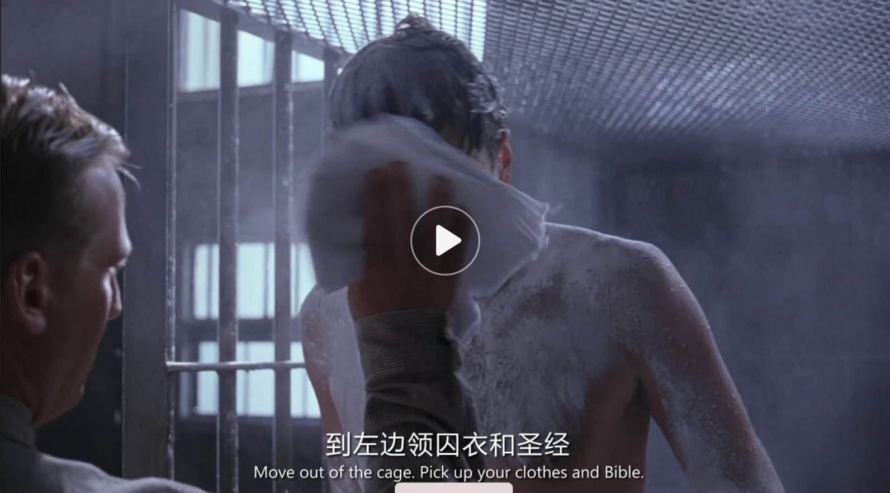
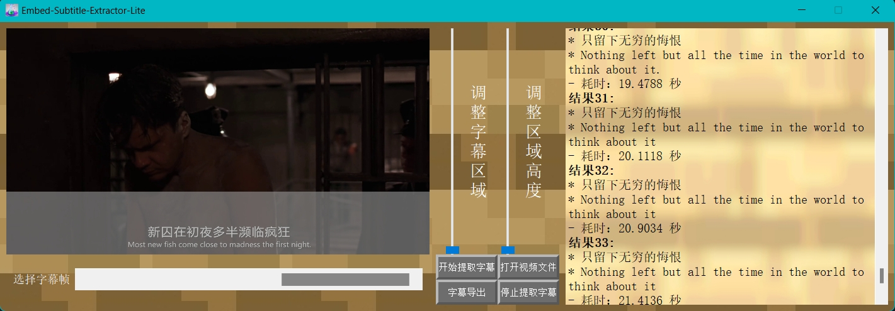
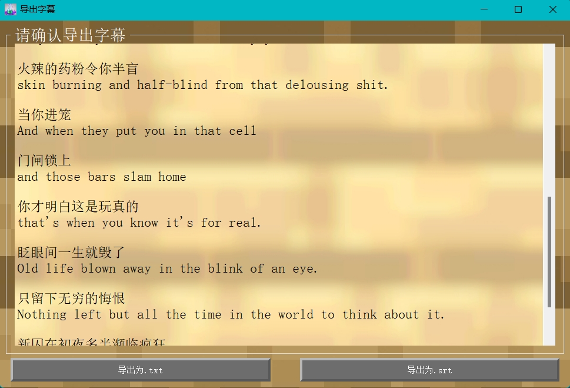
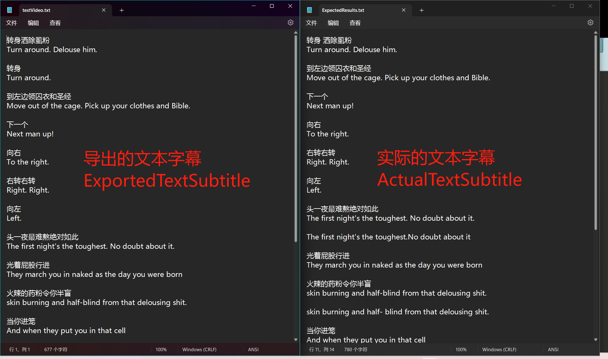

## 简介
> 内嵌字幕提取器（Embed-Subtitle-Extractor-Lite） 旨在打造一款简单实用且快速地识别视频内嵌字幕文本的一款工具。

### 产品架构
- 用户界面使用QtCpp编写

- 后台服务使用Flask进行图像的识别（调用了百度Paddle API）

> **注意：源码里面包含了Qt和Flask**
> **目前Window平台经过测试可用，其他平台暂未开启测试**

### 特点
- 操作简单
- 快速
- 轻量
- 仅需CPU
- 支持大部分语言

### 使用说明

~~- 方式一：使用已经部署在云服务器上的后台服务~~ 

~~> 想快速体验使用工具的可以使用此方式~~

  ~~1. 下载Releases中最新的压缩包（.zip）~~
  ~~2. 解压后双击exe文件即可使用~~

- 方式二：使用本地计算机来后台服务

> 自己想动手本地部署的也可以使用此方式

> ~~如果云服务器上的后台服务版本无法满足需要的识别精度~~，可以使用此方式的本地部署来提高识别精度

   1. 和前一个使用一样，在Releases下载最新的压缩包
   2. 克隆项目存储库`git clone https://github.com/capp-adocia/Embed-Subtitle-Extractor-Lite.git`
   3. 安装flask所需要的pip包
      **注意这里pip包是对Windows平台适用**
      ```
      pip install -r requirements.txt # 仅使用CPU计算
      ```
      如果想使用GPU（极大提高识别速度）计算，**请不要使用以上命令**，请前往[百度paddle](https://www.paddlepaddle.org.cn/)官网进行下载相应的pip包
   4. 启动本地服务
      ```
      python OCR.py
      ```
   5. 成功启动后台服务后，就可以正常提取视频内嵌字幕了

### 测试样例
> 这里使用的视频样例是在本存储库的[testVideo.mp4](ExtractSubtitle/Video)文件

1. MP4 
2. 提取字幕 
3. 字幕导出 
4. 导出字幕VS实际字幕 

### 联系我

> 如果遇到了任何问题，随时可以找我。

-  QQ: 请通过 2636427505 联系我。
-  QQ email: 请发送邮件至 [2636427505@qq.com](https://mail.qq.com/) 联系我。
-  ......

